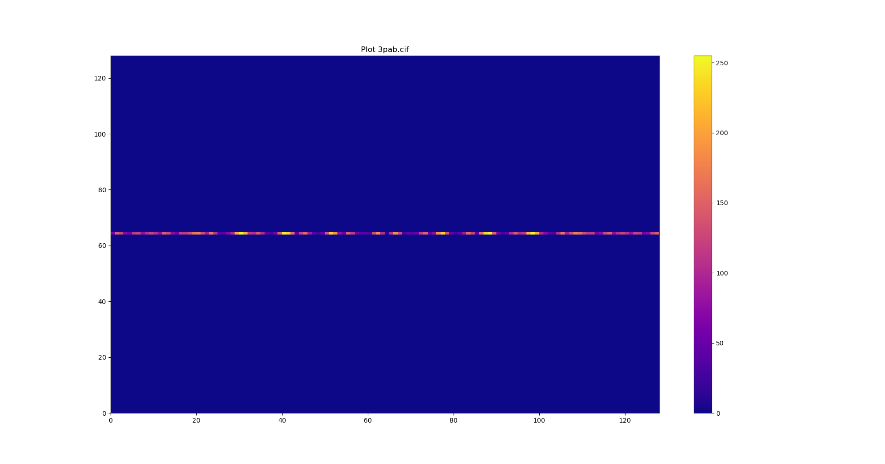

# Welcome to CIF-Viewer

## What's CIF-Viewer?

CIF Viewer is a python3-application that let you see the phase pattern of a cif file.

C U B I C
U \     U \
B   C U B I C
I   U   I   U
C U B I C   B
  \ I     \ I
    C U B I C

For running once installed python3,numpy and matplotlib, (detailed in troubleshooting.md).
open a terminal and write:
python3 testLayers <cifFile> scatteringTables10.csv

example:
$python3 testLayers.py 3pab.cif scatteringTables10.csv



this project it's done, But there is a bug in the fresnel diffraction that doesn't project well
(working on it). but you can contact me:

  ### Contact

  ```bash
  Jack Colquit
  e-mail: rigel1357@yahoo.com
  ```
  ## License

  CIF-Viewer is released under the [MIT License](https://opensource.org/licenses/MIT).

  ##
